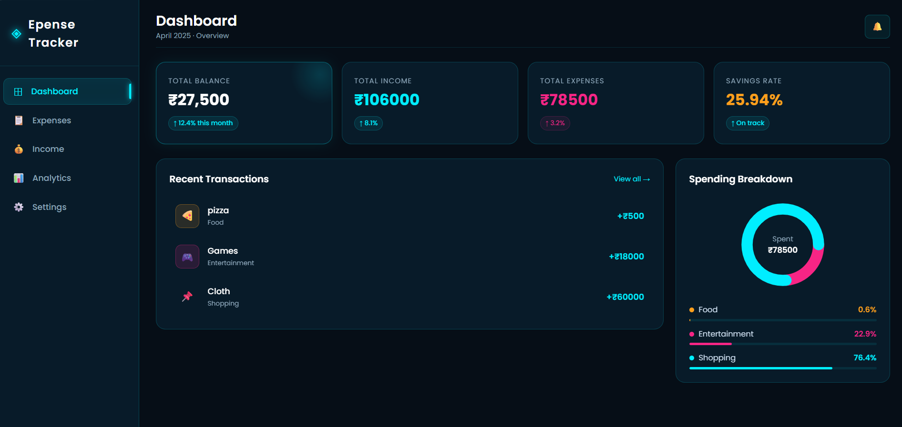
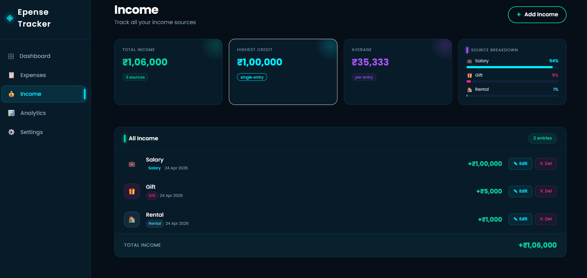
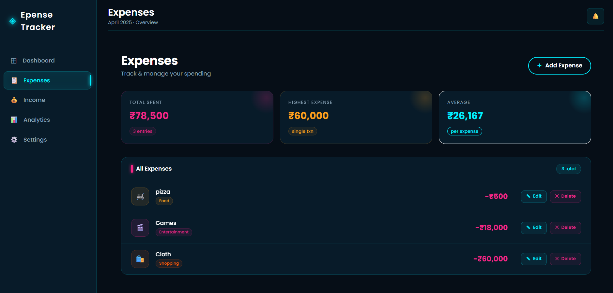
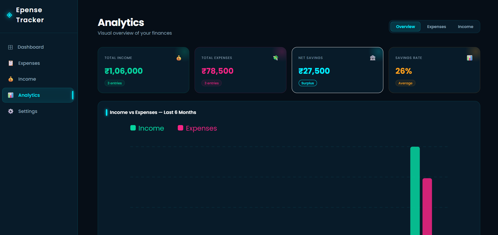

# 💰 Expense Tracker App (Full Stack)

A powerful **Full Stack Expense Tracker Web Application** that helps users manage their **income, expenses, and savings** efficiently with real-time analytics and interactive charts.

---

## 🚀 Features

- ➕ Add Income & Expenses
- ✏️ Edit / Delete Transactions
- 📊 Interactive Charts (Income vs Expense Analysis)
- 📅 Date-wise Tracking System
- 🔐 User Authentication (Login / Logout)
- 👤 User-specific Secure Data
- 📱 Fully Responsive UI
- ⚡ REST API Integration
- 📈 Dashboard with Analytics Overview

---

## 🛠️ Tech Stack

### Frontend
- React.js
- JavaScript / TypeScript
- CSS / Tailwind CSS
- Chart.js / Recharts

### Backend
- Node.js
- Express.js
- REST API

### Database
-  MySQL

### Authentication
- JWT (JSON Web Token)

---

## 📸 Screenshots

### 🏠 Dashboard


### 💸 Add Income 


### 💸 Add Expense


### 📊 Analytics Page



### 🔐 Login Page


---

## 🔄 Project Flow

User Flow of Application:

1. User Login / Signup  
2. Redirect to Dashboard  
3. Add Income / Expense  
4. Data stored in Database  
5. Real-time Balance Update  
6. Analytics Page shows Charts  
7. User can Edit / Delete Transactions  
8. Logout securely

---

## ⚙️ Installation & Setup

### 1. Clone the repository
```bash
git clone https://github.com/your-username/expense-tracker.git
